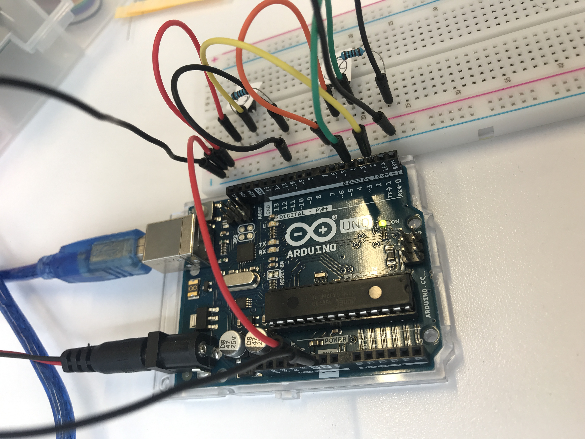
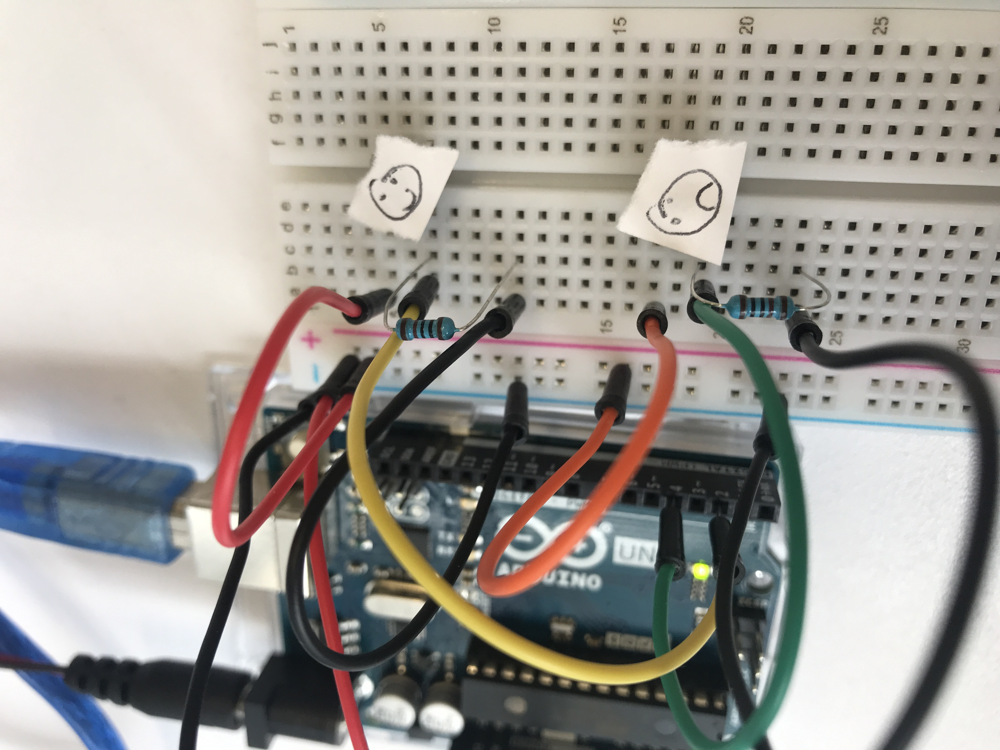

# Sloane-Phone-Node

This is a tutorial using the [Arduino Uno Board](https://store.arduino.cc/usa/arduino-uno-rev3) and the [Johnny-Five](http://johnny-five.io/) JavaScript library. Both are open sourced.

- For an intro and setting up NodeBots check out my [Node_Bots repo](https://github.com/nikkiricks/Node_Bots)
- To see how I took my Sloane Phone to the next level with a board that holds a SIM card and using C++ check out my [Sloane-Phone-Arduino repo](https://github.com/nikkiricks/Sloane-Phone-Arduino)

## The Tech Inspiration

I was listening to the [Code Newbie Podcast](https://www.codenewbie.org/podcast) episode about [node bots](https://www.codenewbie.org/podcast/how-do-you-build-a-robot-in-javascript) with [Rachel White](http://rachelisaweso.me/) and was inspired as she was saying how simple it was to start building robots if you were familiar with javascript. Which felt accessible to me at the time because it was the first programming language that I picked up when learning how to code.

## The Real Life Inspiration

One day, when leaving my kids with a new babysitter, my oldest, who was 6 at the time was nervous about it and didn’t want us to go. Before the babysitter came, I told her that we could create a secret password to pass through the babysitter without him knowing. I said that we could tell the babysitter that my partner and I were going to go grocery shopping and my daughter was going to think about the type of fruit she was wanting us to pick up. But the secret password was, that if she was having a really hard time and needed us to come home she could tell the babysitter to text us saying she wanted “bananas” (a fruit my daughter doesn’t like) but if she was having a great time and didn’t need us to come home she could text us and say she wanted “kiwi” (one of my daughter's favorite fruit).

Bad time = “bananas” Good time = “kiwi”

## How tech and life came together

This experience inspired me, what if I could have left my daughter with a simple device that could text me an emoji how she was feeling as opposed to going through the babysitter? Maybe the two options could be :smiley: or :cry:?

So the idea of the **Sloane Phone** was born.

_By the way, Sloane wanted “kiwi’s”._

## Parts

| Part                                                                  | Source                                                                                                                                                                                                         | Price |
| --------------------------------------------------------------------- | -------------------------------------------------------------------------------------------------------------------------------------------------------------------------------------------------------------- | ----: |
| Arduino Uno Board                                                     | [Arduino Website](https://store.arduino.cc/usa/arduino-uno-rev3)                                                                                                                                               |  \$22 |
| Breadboard, two buttons, wires, resistors from - Freenove Starter Kit | [Freenove Starter Kit](https://www.amazon.com.au/Freenove-Processing-Oscilloscope-Voltmeter-Components/dp/B0721B8228/ref=sr_1_1?keywords=freenove+arduino+uno+starter+kit&qid=1576150765&s=electronics&sr=1-1) |  \$34 |
| **TOTAL**                                                             |                                                                                                                                                                                                                |  \$56 |

## How to send an email in a push of a button (as in an actual button)

Again, if you're not familiar with NodeBots start with my [Node_Bots repo](https://github.com/nikkiricks/Node_Bots) to get set up.

Sign up for [Send Grid](https://sendgrid.com/solutions/email-api/) and get an API key. I found the [github instructions](https://github.com/sendgrid/sendgrid-nodejs/tree/master/packages/mail) really helpful.

Use the Johnny-Five docs and set up a [button](http://johnny-five.io/examples/button/)

Read [these instructions](https://sendgrid.com/blog/how-to-send-email-with-arduino-at-ny-tech-meetup/) from Swift at SendGrid.

Here's the code that I used in my `email-button.js` to send two different emails from two different buttons:

```
var arduino = require("johnny-five")
var board = new arduino.Board()
const sgMail = require('@sendgrid/mail');
sgMail.setApiKey(process.env.SENDGRID_API_KEY);

board.on("ready", function() {
  var buttonTwo = new arduino.Button(2); // Button on pin 2
  var buttonFour = new arduino.Button(4)

  buttonTwo.on("up", function() {
    const msg = {
      to: 'ENTER_EMAIL,
      from: 'ENTER_EMAIL(can't be the same)',
      subject: 'ENTER SUBJECT',
      text: 'testing testing testing',
      html: '<strong>ENTER TEXT FOR BODY OF THE EMAIL</strong>',
    };
    sgMail.send(msg);
    console.log(msg)
  });

  buttonFour.on("up", function() {
    const msg = {
      to: 'ENTER_EMAIL',
      from: 'ENTER_EMAIL',
      subject: 'ENTER SUBJECT',
      text: 'testing testing testing',
      html: '<strong>ENTER TEXT FOR BODY OF THE EMAIL</strong>',
    };
    sgMail.send(msg);
    console.log(msg)
  });
});
```

Here's how I set up my board:




Demo of the setup


## How to send an SMS with the same code

I was running into issues with Twilio - Australia has strong regulations. Because I'm an American and have no Australian documentation I wasn't verified.

- I then tried using [TouchSMS](https://platform.touchsms.com.au/register) but they require you to sign up manually by emailing their support team? No thanks.

-Finally I heard about [MessageMedia](https://hub.messagemedia.com/) where you can easily send a text using an email address if the number you're trying to text is "+610577355263" you could just add it to "@e2s.messagemedia.com" so it would be "610577355263@e2s.messagemedia.com". So easy! I highly recommend it.

## Challenges

- **Hardware** was both fun and frustrating. It was interesting to research the kit I purchased and see what I could do with all of the pieces but frustrating when I would purchase a piece and then needed something else to go along with it.

  - GSM was going to cost $70 and then $70 to ship to get here with just 3 days to code on it which I didn't feel comfortable with. So I decided to get a Wifi Shield instead and try and code on it that way
  - I was waiting on an NodeMCU and didn't end up getting it in time to implement into the project

## Resources

- Sending SMS from Arduino over internet on [instructables](https://www.instructables.com/id/Send-SMS-from-Arduino-over-the-Internet-using-ENC2/)
